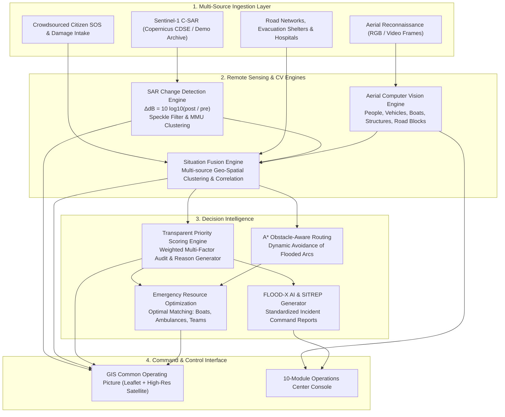

# FLOOD-X: AI-Powered Flood Intelligence & Disaster Response Platform

> **Problem Statement:** SIH26206 — Student Innovation – Disaster Management  
> **Target Theme:** Flood Response, Remote Sensing, GIS Common Operating Picture (COP), and AI Decision Support

---

## 1. Executive Summary

**FLOOD-X** is an end-to-end, operational disaster-intelligence command center that fuses satellite radar observations (Copernicus Sentinel-1 SAR), aerial drone computer vision, crowdsourced citizen distress calls (SOS), lifeline road accessibility graphs, and emergency resource management into a single, cohesive Common Operating Picture (COP).

Unlike mock dashboards or black-box predictions, FLOOD-X features a mathematical SAR change-detection engine ($\Delta\text{dB}$ backscatter ratio), transparent explainable priority scoring, obstacle-aware rescue route optimization, and an automated Emergency Situation Report (SITREP) generator grounded in live application state.

---

## 2. Multi-Sensor Intelligence Pipeline



---

## 3. Technology Stack

- **Frontend:**
  - React 18 with TypeScript
  - Tailwind CSS (high-contrast dark GIS theme designed for emergency operations centers)
  - Leaflet GIS with ESRI World Imagery basemap, vector polygon overlays, dynamic opacity sliders, and custom marker layers
  - Recharts for radar backscatter change histograms and flood severity distributions
  - Lucide React iconography
  - Vite 6 fast bundler

- **Backend:**
  - Node.js (v24+) with Express REST API in TypeScript (ES Modules)
  - Structured transactional memory store with deterministic multi-region presets
  - Multer file ingestion for aerial drone frames and video snapshots
  - Native Fetch client with OAuth2 token caching for Copernicus CDSE

- **Remote Sensing & SAR:**
  - Sentinel-1 GRD Interferometric Wide (IW) mode C-band SAR processing
  - Dual polarization: VV / VH (VV primary for surface water specular scattering)
  - Logarithmic ratio change detection: $\Delta\text{dB} = 10 \cdot \log_{10}(\sigma^0_{\text{post}} / \sigma^0_{\text{pre}})$
  - 3x3 median spatial speckle filter
  - Minimum Mapping Unit (MMU) cluster filter
  - GeoJSON polygon vectorizer

- **AI & Decision Intelligence:**
  - Google Gemini API integration (`gemini-1.5-flash`) for natural-language incident audits and grounded decision-support Q&A
  - Aerial Computer Vision detection pipeline for surface survivors, submerged vehicles, boats, and road blockages
  - Transparent explainable multi-factor priority scoring algorithm with user-configurable weights
  - Obstacle-aware graph routing avoiding flooded road arcs

---

## 4. Key Mathematical & Algorithmic Formulations

### A. SAR Backscatter Change Detection
Flooded surfaces act as specular reflectors, scattering C-band microwave energy away from the radar antenna and resulting in a steep decline in radar backscatter ($\sigma^0$):
$$\Delta \text{dB} = 10 \cdot \log_{10}\left(\frac{\sigma^0_{\text{post}}}{\sigma^0_{\text{pre}}}\right) = \sigma^0_{\text{post, dB}} - \sigma^0_{\text{pre, dB}}$$

- **Preset Thresholds:**
  - Sensitive: $-2.0\text{ dB}$ (captures shallow inundation and wet soil)
  - Standard: $-3.0\text{ dB}$ (optimal balance for open overbank floodwater)
  - Strict: $-4.5\text{ dB}$ (captures only deep, open standing water bodies)

### B. Transparent Incident Priority Scoring
Unlike black-box neural prioritization, FLOOD-X uses a verifiable multi-criteria decision formula:
$$\text{Priority Score} = w_{\text{flood}} \cdot S_{\text{flood}} + w_{\text{people}} \cdot N_{\text{people}} + w_{\text{sos}} \cdot U_{\text{sos}} + w_{\text{medical}} \cdot U_{\text{medical}} + w_{\text{access}} \cdot R_{\text{access}}$$

- **Default Weights:**
  - $w_{\text{flood}} = 0.30$ (SAR radar inundation intensity)
  - $w_{\text{people}} = 0.25$ (Population exposed & aerial survivors detected)
  - $w_{\text{sos}} = 0.20$ (Citizen distress call volume)
  - $w_{\text{medical}} = 0.15$ (Critical medical emergencies: dialysis, oxygen, infant)
  - $w_{\text{access}} = 0.10$ (Road isolation risk and distance to nearest shelter)

- **Categorization:**
  - $\ge 0.75 \rightarrow \mathbf{CRITICAL}$
  - $0.50 - 0.74 \rightarrow \mathbf{HIGH}$
  - $0.28 - 0.49 \rightarrow \mathbf{MEDIUM}$
  - $< 0.28 \rightarrow \mathbf{LOW}$

---

## 5. Navigation & Application Modules

1. **COMMAND CENTER:** High-density GIS operations dashboard combining the interactive map, real-time KPIs, active incidents queue, decision audit reasons, nearest resource recommendations, and 1-click dispatch.
2. **LIVE FLOOD MAP:** Dedicated full-screen Common Operating Picture (COP) with layer opacity sliders, road blockage markers, shelters, resources, and live coordinates tracking.
3. **SATELLITE ANALYSIS:** Sentinel-1 C-SAR observation metadata, mandatory satellite disclosures, interactive $\Delta\text{dB}$ slider, MMU controls, backscatter histogram chart, and 14-step verification chain.
4. **AERIAL / DRONE ANALYSIS:** Visual reconnaissance workspace with canvas bounding boxes, detection metrics (people, vehicles, boats, structures), and operator review buttons ("RESCUE", "REJECT").
5. **INCIDENTS & SOS:** Crowdsourced emergency submission form (GPS coordinates, category, severity, affected counts, medical urgency) and live triage stream.
6. **DAMAGE ASSESSMENT:** Structural degradation classification for lifelines, roads, bridges, and agricultural zones with economic impact estimates and rebuild ranks (1 to 5).
7. **RESOURCE OPTIMIZATION:** Emergency fleet inventory, configurable priority weights sliders, and obstacle-aware graph routing avoiding flooded road arcs.
8. **DISASTER MANAGEMENT:** Phased recovery priority sequence (Hospital route $\rightarrow$ Residential settlement $\rightarrow$ Bridge clearance $\rightarrow$ Power grid $\rightarrow$ Agriculture).
9. **SYSTEM STATUS:** Real-time health monitor of all sub-systems (Copernicus API, Sentinel-1 feed, GIS, AI engine, Database, Drone analysis, Citizen network) and demo reset button.

---

## 6. Location Presets & Geographic Coverage

- **Emilia-Romagna Floods — Demo (Italy):** Historic May 2023 catastrophe along Lamone & Montone rivers (Faenza, Forlì, Ravenna). Includes critical incident `FLD-001`.
- **India — National View:** Monsoon basin surveillance across all major Indian river systems.
- **Bengaluru (Karnataka):** Urban inundation across Bellandur lake basin and Outer Ring Road tech corridors.
- **Mumbai (Maharashtra):** High-tide confluence and overbank spillover along Mithi River and Kurla West.
- **Chennai (Tamil Nadu):** Cyclone runoff and river overflow across Adyar basin and Velachery lowlands.
- **Kerala (Periyar Basin):** Catchment downpour and river spate inundating Aluva floodplain.
- **Guwahati (Assam):** Brahmaputra floodplains backflowing into urban drainage channels.
- **Manual Bounding Box:** Custom decimal degree coordinates entry ($^\circ\text{N}, ^\circ\text{S}, ^\circ\text{W}, ^\circ\text{E}$).

---

## 7. 15-Step Hackathon Presentation Guide (3-5 Minutes)

Click the **DEMO STORY** button in the top navigation bar to launch the interactive presentation guide:

1. **Step 1:** Open **COMMAND CENTER**; highlight the live operational LEDs and dark GIS interface.
2. **Step 2:** Select **Emilia-Romagna Floods — Demo** preset; observe auto-fitting bounding box.
3. **Step 3:** Navigate to **SATELLITE ANALYSIS**; review Sentinel-1 C-SAR observation metadata and satellite disclosure banner.
4. **Step 4:** Execute SAR Change Detection Pipeline; adjust $\Delta\text{dB}$ slider and show the backscatter histogram.
5. **Step 5:** Review calculated flood metrics: $440.5\text{ km}^2$ flooded extent, $12.5\%$ coverage.
6. **Step 6:** Open **AERIAL / DRONE ANALYSIS**; upload aerial imagery or switch scenario frames.
7. **Step 7:** Inspect AI bounding boxes detecting stranded persons on rooftops; click **RESCUE** to approve.
8. **Step 8:** Open **INCIDENTS & SOS**; show crowdsourced citizen distress calls with medical urgency flags.
9. **Step 9:** Return to **COMMAND CENTER**; observe how the Fusion Engine correlates all layers.
10. **Step 10:** Click on critical incident **FLD-001**; observe live pulsing red marker on map.
11. **Step 11:** Inspect the **Transparent Decision Audit** card explaining the 7 reasons why FLD-001 is CRITICAL.
12. **Step 12:** Open **RESOURCE OPTIMIZATION**; show fleet inventory and tweak priority formula weights.
13. **Step 13:** Execute **1-Click Dispatch** for Vigili del Fuoco SAR Boat Alpha; observe calculated detour avoiding flooded Via Renaccio.
14. **Step 14:** Click **GENERATE SITREP**; inspect the official ICS emergency report with limitations and disclaimer.
15. **Step 15:** Open **DAMAGE ASSESSMENT** and **DISASTER MANAGEMENT**; present post-disaster structural ranks and hospital road priority #1.

---

## 8. REST API Documentation

| Method | Endpoint | Description |
|---|---|---|
| `GET` | `/api/status` | System health check and live vs. demo mode indicator |
| `GET` | `/api/presets` | Available regional geographic presets and active AOI |
| `POST` | `/api/presets/select` | Switch active preset or set custom bounding box |
| `GET` | `/api/incidents` | List all fused active incident records |
| `GET` | `/api/incidents/:id` | Detailed incident record with priority breakdown |
| `POST` | `/api/incidents` | Create a new incident cluster |
| `POST` | `/api/incidents/:id/sos`| Submit a citizen SOS distress call linked to an incident |
| `POST` | `/api/incidents/:id/damage`| Submit structural damage report linked to an incident |
| `GET` | `/api/incidents/:id/priority`| Transparent mathematical priority score and reasons |
| `GET` | `/api/priority/weights` | Retrieve current priority formula weights |
| `POST` | `/api/priority/weights`| Dynamically update weights and re-rank all incidents |
| `GET` | `/api/satellite/latest` | Latest Sentinel-1 observation scene metadata |
| `GET` | `/api/satellite/search` | Query Copernicus CDSE catalog or fallback demo scenes |
| `POST` | `/api/satellite/process` | Run SAR change detection with threshold, MMU, filters |
| `GET` | `/api/satellite/current-result`| Retrieve latest calculated SAR raster metrics & GeoJSON |
| `GET` | `/api/drone/detections` | Retrieve all aerial object detections |
| `POST` | `/api/drone/analyze` | Upload and analyze an aerial drone image/frame |
| `POST` | `/api/drone/detections/:id/approve`| Approve, reject, or flag detection for tactical rescue |
| `GET` | `/api/resources` | Emergency response fleet status (boats, ambulances, teams)|
| `POST` | `/api/resources/recommend` | Recommend optimal nearest asset for an incident |
| `POST` | `/api/resources/assign` | Dispatch resource to incident sector |
| `GET` | `/api/shelters` | Active evacuation shelters and occupancy |
| `GET` | `/api/roads` | Road segments with status (OPEN, PARTIALLY_BLOCKED, BLOCKED)|
| `POST` | `/api/routing/safe-route`| Compute obstacle-aware safe route avoiding blocked roads |
| `POST` | `/api/sitrep` | Generate official emergency situation report |
| `POST` | `/api/chat` | Query FLOOD-X AI assistant grounded in live application state |
| `POST` | `/api/reset` | Re-initialize all demo datasets to baseline state |

---

## 9. Environment Variables & Security

Create a `.env` file in the project root:

```env
# Server Port
PORT=5000

# Copernicus Data Space Ecosystem (CDSE) OAuth2 Credentials (Optional for Live SAR)
COPERNICUS_CLIENT_ID=your_copernicus_client_id_here
COPERNICUS_CLIENT_SECRET=your_copernicus_client_secret_here

# Google Gemini API Key (Optional for Live Gemini AI; fallback decision engine active by default)
GEMINI_API_KEY=your_gemini_api_key_here

# Environment
NODE_ENV=development
```

> **Security Rule:** As per Section 28, API credentials and secrets are strictly loaded server-side and never exposed to the frontend bundle.

---

## 10. How to Run Locally

### Prerequisites
- Node.js v20+ or v24+
- npm v10+

### Option A: Unified Production Server (Port 5000)
```bash
# 1. Install & Build Backend
cd backend
npm install
npm run build

# 2. Install & Build Frontend
cd ../frontend
npm install
npm run build

# 3. Start Unified Server
cd ../backend
npm start
```
Open `http://localhost:5000` in your browser.

### Option B: Concurrent Development Mode
```bash
# Terminal 1: Backend API (Port 5000)
cd backend
npm install
npm run dev

# Terminal 2: Frontend Vite Dev Server (Port 3000)
cd frontend
npm install
npm run dev
```
Open `http://localhost:3000` in your browser (Vite automatically proxies `/api` requests to port 5000).

---

## 11. Data Integrity & Operational Disclosures

1. **Satellite Periodic Acquisition:** Sentinel-1 is an orbital SAR satellite platform providing periodic acquisitions (typically 6-12 day repeat passes), not continuous streaming video.
2. **Deterministic Demo Mode:** When live Copernicus API or satellite scenes are unavailable, the platform explicitly displays `DEMO MODE — SYNTHETIC DATA`. It never fabricates observations, timestamps, or fake live feeds.
3. **Computer Vision Constraints:** Aerial object detection is limited to optical surface features. The platform explicitly discloses that optical sensors cannot detect through murky standing water or collapsed interior voids.
4. **Human-in-the-Loop Mandate:** Every AI-generated decision recommendation and Situation Report prominently states:
   > *"AI-generated decision support — human verification required by Incident Commander before executing field orders."*

---

## 12. Smart India Hackathon 2026 Innovation Highlights

- **Multi-Source Spatial Convergence:** Eliminates information silos by fusing satellite radar, drone tactical reconnaissance, and citizen distress calls into a single Common Operating Picture.
- **Explainable Decision Engine:** Moves disaster management beyond arbitrary AI suggestions by providing transparent mathematical audit trails for priority classifications.
- **Obstacle-Aware Graph Dispatch:** Bridges the gap between incident detection and resource allocation by calculating detour routes that navigate around submerged roads.
- **Standardized Incident Command Deliverables:** Generates 1-click printable and markdown SITREPs compliant with standard disaster response protocols.